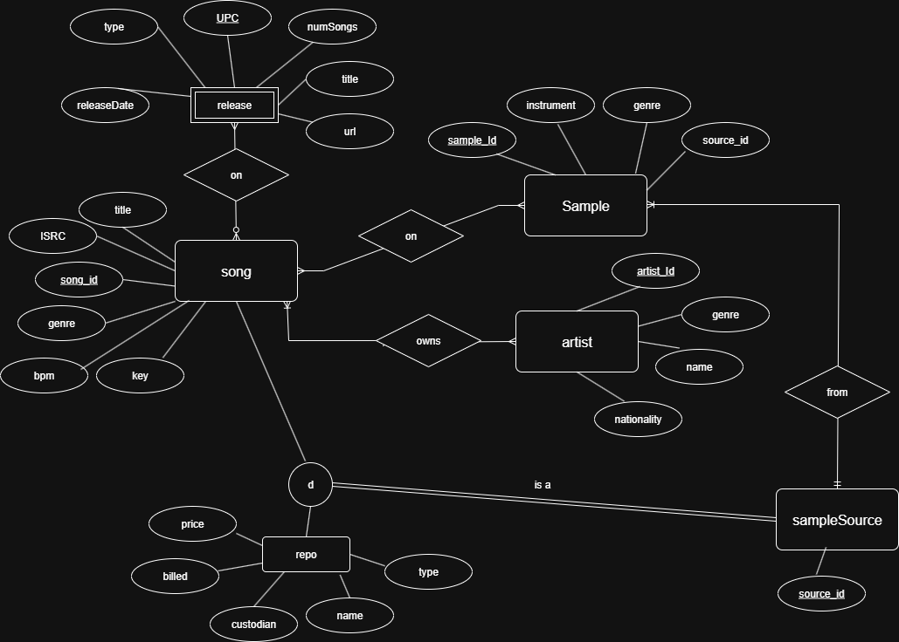

# music-samples-database
Project for CSCI 240 Databases &amp; SQL - A database describing the audio samples I’ve used in my electronically produced music. 

# Work Breakdown Structure

# ER Diagram

